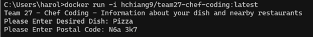
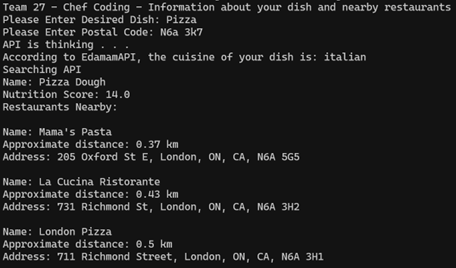

**Project Description**

This project integrates multiple public APIs to answer discover where the healthiest food options available are given location and desired food, based on nutritional data from multiple sources. To do this, we combine location-based vendor data from Geoapify with nutritional insights from Spoonacular, Edamam, and Open Food Facts. The system identifies food items or dishes served nearby and evaluates their healthiness using ingredient-level nutrition analysis and Nutri-Score ratings.

**Scope**

This project focuses on real-world food discovery by finding healthier food options available near you. The system helps users make informed decisions when dining out or ordering in, by analyzing food offerings at nearby locations.

**Geoapify Places API**

Used to find nearby restaurants, grocery stores, and food vendors based on geolocation.

**Spoonacular API**

Provides comprehensive food and nutrition data, including meal types, ingredients, and macro/micronutrient breakdowns.

Useful endpoints:

Search Recipes by Ingredients

Get Nutrition by ID

Get Ingredient Information

Search Grocery Products

Get Product Information

**Edamam API**

Used to analyze ingredient lists or food names to return nutritional information and health labels.

Key feature: ingredientLines for submitting composite foods and extracting nutrition data.

Edamam Recipe API

Open Food Facts API

Provides product-level nutrition data, including Nutri-Score, ingredient lists, and health labels.

Useful fields: product_name, barcode, nutriscore_data, and other nutrition metrics.

Data Portal

API Reference

**Goal**
By combining location-based food discovery with recipe / dish lookup and nutrition evaluation tools, this project enables users to:

Identify menu items or food products desired

Find restaurants or vendors nearby

Evaluate the healthiness of those offerings using nutritional metrics

Recommend the healthiest nearby options

**APIS Used**

https://developer.edamam.com/edamam-recipe-api

https://apidocs.geoapify.com/

https://openfoodfacts.github.io/openfoodfacts-server/api/

https://spoonacular.com/food-api

**Usage**

Public container image: https://hub.docker.com/r/hchiang9/team27-chef-coding/tags
Note: Due to user input within the program, the program must be run through Docker on
Command Prompt, not Docker Desktop. The –i flag must be used when running this Docker
container ex. docker run -i hchiang9/team27-chef-coding:latest

1. Run the program, either through downloading code to run locally or through Docker
as mentioned

2. Enter a dish that you would like to find the Nutri-score (indicating how healthy it is)
and your postal code.

  a. Dish name is not case-sensitive

  b. Postal code is not case-sensitive, HOWEVER ensure that it is in the form of (letter)(number)(letter)(SPACE) (number)(letter)(number). Ex. N6A 3K7

3. Let the program run. If the APIs are successful in finding a recipe for your dish, they
will display a recipe followed by details of up to 3 restaurants nearby that may serve
your dish.

  a. Note: Results may vary with dish name and location. Restaurants are searched through your location and the cuisine of the user-entered dish. 

**Project Credits**

Muhammad Ahmad: Created OpenFoodFacts API and it's corresponding tests

Kwan Nok Lau: Integrated Geoapify API and it's corresponding tests

Harold Chiang: Integrated Spoonacular API, it's corresponding tests, responsible for packaging project into docker container, and helped with debugging

Andrew Liang: Integrated Edamam API, it's corresponding tests, consolidated all other modules into a single application, and helped with debugging

